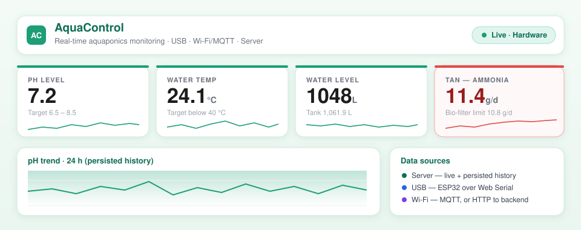

# AquaControl 🐟🌱



A full‑stack, real‑time monitoring system for a 40‑fish / 40‑plant aquaponics build
(ENG SCI 1050, Western University). The dashboard is a single `index.html` with **no
build step**; it reads **real hardware** four ways — a Node backend, USB (Web Serial),
Wi‑Fi (MQTT), or a built‑in physics simulation fallback.

**Live demo:** open `index.html`, host it on GitHub Pages, or run the backend (below)
to get persisted history + live streaming.

---

## What it does

- **Live sensor cards** — pH, water temperature, water level, and TAN (ammonia),
  each with an in‑range/out‑of‑range state and a rolling **sparkline** of recent history.
- **System health score** + **engineering‑constraints pass/fail table** that update
  in real time from the current readings.
- **Design calculators** — fish‑growth model `W = 5·e^(0.015·t)`, daily water‑makeup
  mass balance, and nitrogen / bio‑filter sizing.
- **CSV export** of everything the dashboard has logged this session.
- **Four data sources**, chosen at runtime:

| Source | How | When to use |
|--------|-----|-------------|
| **Server** | Node backend persists readings + streams them over WebSocket | Trend history, remote viewing, the full‑stack demo |
| **USB (Web Serial)** | ESP32/Arduino plugged in over USB | Bench demo, judging table |
| **Wi‑Fi (MQTT)** | ESP32 publishes to an MQTT broker | Wireless, no backend |
| **Simulation** | Built‑in, runs when nothing is connected | No hardware on hand |

---

## Full‑stack: the backend (`/server`)

A small Node server (`server/server.js`) makes this a real full‑stack app:

- **Ingest** — the ESP32 `POST`s readings to `/api/telemetry`.
- **Persist** — every reading is stored in **SQLite** (Node's built‑in `node:sqlite` —
  no native build, no external DB).
- **Stream** — each new reading is pushed to every open dashboard over **WebSocket**,
  so multiple people see the tank live, in real time.
- **History** — `GET /api/history?hours=24` returns (down‑sampled) trend data that
  powers the in‑dashboard charts; data survives restarts and page reloads.
- **Serve** — it also serves the dashboard itself, so the whole thing is one deploy.

```bash
cd server
npm install
npm run seed     # optional: fill ~24h of demo data so charts aren't empty
npm start        # http://localhost:8080  (dashboard + API + WebSocket)
```

Then open the dashboard, click **Connect to server**, and you get live readings plus
the trend chart. Point the ESP32 at it by setting `USE_WIFI 1` and `USE_HTTP 1` in the
firmware.

### API

| Method | Route | Purpose |
|--------|-------|---------|
| `POST` | `/api/telemetry` | Ingest a reading `{ph,temp,level,tan,device?}` |
| `GET`  | `/api/history?hours=24&max=1500` | Trend data (down‑sampled) |
| `GET`  | `/api/latest` | Most recent reading |
| `GET`  | `/api/health` | `{ok, readings, uptime_s}` |
| `WS`   | `/ws` | Live push of every new reading |

Set `INGEST_KEY` to require an `x-api-key` header on writes. CORS is open on reads so a
dashboard hosted elsewhere (GitHub Pages) can pull history from a deployed backend.

### Deploy (free)
`server/Dockerfile` and `server/render.yaml` are included. On [Render](https://render.com):
**New + → Blueprint → point at this repo**. Node 22+ is required (for `node:sqlite`).

---

## Connect real hardware

### Option A — USB (Web Serial)
1. Flash the firmware (below) to an ESP32 and plug it into the laptop.
2. Open the dashboard in **Chrome or Edge** (Web Serial requires it), served over
   `https://` or `localhost`.
3. Click **Connect via USB**, pick the serial port, done — cards go live and the
   badge switches to `USB · ESP32`.

### Option B — Wi‑Fi (MQTT)
1. In the firmware set `USE_WIFI 1`, fill in your Wi‑Fi + broker, flash.
2. In the dashboard click **Connect via Wi‑Fi (MQTT)**, confirm the broker URL and
   topic (defaults to the public HiveMQ broker), click **Subscribe**.

---

## Telemetry protocol

The device streams **newline‑delimited JSON**, one reading per line, at **115200 baud**:

```json
{"ph":7.21,"temp":24.1,"level":1048,"tan":8.4}
```

- Every field is optional — send any subset; missing fields keep their last value,
  so sensors can report at different rates.
- A bare CSV line `ph,temp,level,tan` (e.g. `7.21,24.1,1048,8.4`) is also accepted.

| Field   | Unit     | Meaning                                  |
|---------|----------|------------------------------------------|
| `ph`    | —        | pH of the tank water                     |
| `temp`  | °C       | Water temperature                        |
| `level` | L        | Water volume in the tank                 |
| `tan`   | g/day    | Total ammonia nitrogen load              |

---

## Firmware

Sketch: [`firmware/aquacontrol_esp32/aquacontrol_esp32.ino`](firmware/aquacontrol_esp32/aquacontrol_esp32.ino)

**Board:** ESP32 Dev Module (Espressif esp32 core).
**Libraries:** `OneWire`, `DallasTemperature`, and `PubSubClient` (only if `USE_MQTT 1`).
**Transports:** Serial/USB is always on. Set `USE_WIFI 1` plus either `USE_HTTP 1`
(POST to the backend — recommended) or `USE_MQTT 1` (publish to a broker).

### Default wiring

| Sensor | Part (example) | ESP32 pin |
|--------|----------------|-----------|
| pH | analog pH board, e.g. DFRobot SEN0161 | `GPIO34` (ADC1) |
| Temperature | DS18B20 waterproof probe (4.7 kΩ pull‑up) | `GPIO4` |
| Water level | HC‑SR04 ultrasonic | `TRIG GPIO5`, `ECHO GPIO18` |
| TAN (optional probe) | ion‑selective ammonia electrode | `GPIO35` (ADC1) |

> **Calibrate before trusting readings.** Set `PH_V_AT_7` / `PH_V_AT_4` from pH 7.0
> and 4.0 buffer solutions, and `SENSOR_GAP_CM` from your sensor‑to‑water distance.
> TAN has no cheap inline probe, so by default it's **estimated** from feed mass
> (`TAN = feed_g/day · protein% · 0.092`, per Timmons & Ebeling). Set
> `TAN_FROM_PROBE 1` if you have a real ammonia electrode.

### Upload
1. Arduino IDE → install the **esp32** boards package and the libraries above.
2. Select **ESP32 Dev Module** and the right COM port.
3. Upload. Open Serial Monitor at **115200** — you should see JSON lines every 2 s.

---

## Run without hardware
Just open `index.html`. It starts in **Simulation** mode (random‑walk physics within
realistic bounds) so every feature — alerts, health score, constraints, sparklines,
CSV export — is demoable on a laptop with nothing plugged in. The on‑screen
simulation controls let you force alert conditions for a walkthrough.

---

## Architecture

```
  ESP32 sensors ──USB serial──────────────┐
        │                                  ├──▶  AquaControl dashboard (index.html)
        ├──Wi-Fi MQTT──▶ broker ───────────┤        live cards · sparklines · trend chart
        │                                  │
        └──Wi-Fi HTTP──▶ Node backend ─────┘
                          (Express + ws + SQLite)
                          persists history, broadcasts over WebSocket
```

## Tech notes
- **Frontend:** pure HTML/CSS/JS, single file, no build step, no frontend deps
  (MQTT.js is lazy‑loaded from a CDN only if you use the Wi‑Fi/MQTT path). Charts and
  sparklines are hand‑drawn on `<canvas>`.
- **Backend:** Node + Express + `ws` + `node:sqlite` (built in — no native modules).
- `applyReading({ph,temp,level,tan})` is the single entry point all four sources feed
  into, so adding another transport is a few lines.
- Web Serial is a Chromium‑only API and needs a secure context (`https`/`localhost`).
